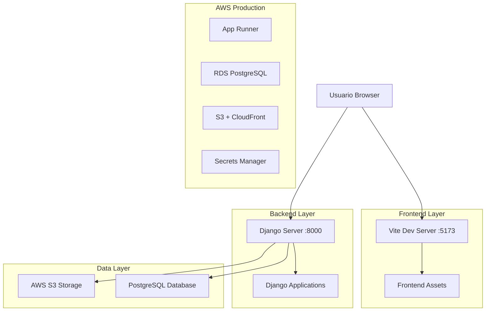
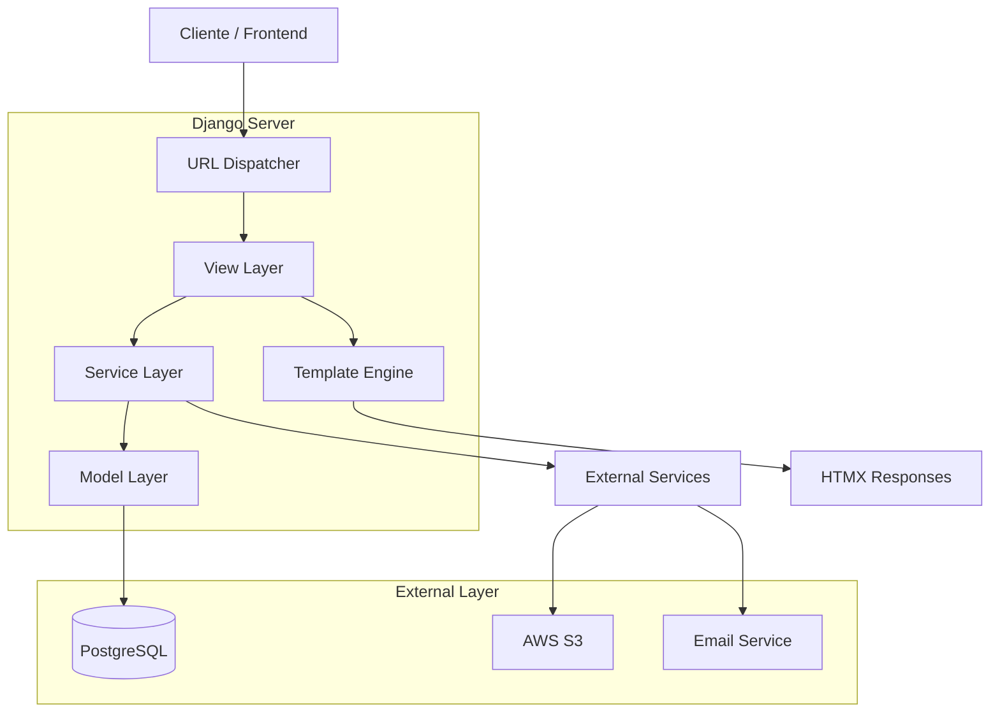
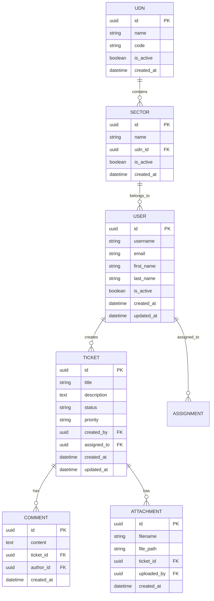

# Arquitectura Técnica - Proyecto Welp

## 1. Diseño de Arquitectura



## 2. Descripción de Tecnologías

### Frontend

* **Vite**: Build tool y dev server con hot reload

* **Tailwind CSS v4**: Framework CSS utility-first

* **HTMX 2.0**: Interactividad sin JavaScript pesado

* **django-components**: Componentes reutilizables

### Backend

* **Django 5.0**: Framework web principal

* **Python 3.11**: Lenguaje de programación

* **Gunicorn**: Servidor WSGI para producción

* **Django REST Framework**: API endpoints

### Base de Datos

* **PostgreSQL**: Base de datos relacional

* **AWS RDS**: Servicio administrado en producción

* **Migraciones**: Automáticas via Django ORM

### Infraestructura

* **AWS App Runner**: Plataforma de despliegue

* **AWS S3**: Almacenamiento de archivos

* **CloudFront**: CDN para assets estáticos

* **Secrets Manager**: Gestión segura de credenciales

## 3. Definiciones de Rutas

| Ruta        | Propósito                    | Aplicación             |
| ----------- | ---------------------------- | ---------------------- |
| `/`         | Página principal y dashboard | core                   |
| `/login/`   | Autenticación de usuarios    | core                   |
| `/admin/`   | Panel administrativo Django  | django.contrib.admin   |
| `/desk/`    | Sistema de helpdesk          | welp\_desk             |
| `/payflow/` | Circuito de compras y pagos  | welp\_payflow          |
| `/api/`     | Endpoints REST API           | api                    |
| `/dev/`     | Herramientas de desarrollo   | core (solo DEBUG=True) |

## 4. Definiciones de API

### 4.1 API Core

#### Autenticación

```
POST /api/auth/login/
```

**Request:**

| Parámetro | Tipo   | Requerido | Descripción       |
| --------- | ------ | --------- | ----------------- |
| username  | string | true      | Nombre de usuario |
| password  | string | true      | Contraseña        |

**Response:**

| Parámetro   | Tipo    | Descripción                   |
| ----------- | ------- | ----------------------------- |
| success     | boolean | Estado de la autenticación    |
| user\_id    | integer | ID del usuario autenticado    |
| permissions | array   | Lista de permisos del usuario |

#### Gestión de Tickets

```
GET /api/tickets/
POST /api/tickets/
GET /api/tickets/{id}/
PUT /api/tickets/{id}/
```

**Ticket Model:**

```json
{
  "id": 1,
  "title": "Solicitud de soporte",
  "description": "Descripción del problema",
  "status": "open",
  "priority": "medium",
  "assigned_to": 2,
  "created_by": 1,
  "created_at": "2024-01-15T10:30:00Z",
  "updated_at": "2024-01-15T10:30:00Z"
}
```

## 5. Arquitectura del Servidor



## 6. Modelo de Datos

### 6.1 Definición del Modelo



### 6.2 DDL (Data Definition Language)

#### Tabla de Usuarios

```sql
-- Tabla principal de usuarios (extiende AbstractUser)
CREATE TABLE core_user (
    id UUID PRIMARY KEY DEFAULT gen_random_uuid(),
    username VARCHAR(150) UNIQUE NOT NULL,
    email VARCHAR(254) UNIQUE NOT NULL,
    first_name VARCHAR(150) NOT NULL,
    last_name VARCHAR(150) NOT NULL,
    is_active BOOLEAN DEFAULT TRUE,
    is_staff BOOLEAN DEFAULT FALSE,
    is_superuser BOOLEAN DEFAULT FALSE,
    date_joined TIMESTAMP WITH TIME ZONE DEFAULT NOW(),
    last_login TIMESTAMP WITH TIME ZONE,
    password VARCHAR(128) NOT NULL
);

-- Índices para optimización
CREATE INDEX idx_core_user_username ON core_user(username);
CREATE INDEX idx_core_user_email ON core_user(email);
CREATE INDEX idx_core_user_active ON core_user(is_active);
```

#### Tabla de UDN (Unidades de Negocio)

```sql
CREATE TABLE core_udn (
    id UUID PRIMARY KEY DEFAULT gen_random_uuid(),
    name VARCHAR(200) NOT NULL,
    code VARCHAR(10) UNIQUE NOT NULL,
    is_active BOOLEAN DEFAULT TRUE,
    created_at TIMESTAMP WITH TIME ZONE DEFAULT NOW(),
    updated_at TIMESTAMP WITH TIME ZONE DEFAULT NOW()
);

CREATE INDEX idx_core_udn_code ON core_udn(code);
CREATE INDEX idx_core_udn_active ON core_udn(is_active);
```

#### Tabla de Sectores

```sql
CREATE TABLE core_sector (
    id UUID PRIMARY KEY DEFAULT gen_random_uuid(),
    name VARCHAR(200) NOT NULL,
    udn_id UUID NOT NULL REFERENCES core_udn(id),
    is_active BOOLEAN DEFAULT TRUE,
    created_at TIMESTAMP WITH TIME ZONE DEFAULT NOW(),
    updated_at TIMESTAMP WITH TIME ZONE DEFAULT NOW()
);

CREATE INDEX idx_core_sector_udn ON core_sector(udn_id);
CREATE INDEX idx_core_sector_active ON core_sector(is_active);
```

#### Datos Iniciales

```sql
-- UDN por defecto
INSERT INTO core_udn (name, code) VALUES 
('Administración', 'ADM'),
('Tecnología', 'TEC'),
('Operaciones', 'OPE');

-- Sectores por defecto
INSERT INTO core_sector (name, udn_id) VALUES 
('Sistemas', (SELECT id FROM core_udn WHERE code = 'TEC')),
('Soporte', (SELECT id FROM core_udn WHERE code = 'TEC')),
('Compras', (SELECT id FROM core_udn WHERE code = 'ADM')),
('Finanzas', (SELECT id FROM core_udn WHERE code = 'ADM'));
```

## 7. Configuración de Entornos

### Variables de Entorno Requeridas

#### Desarrollo Local (.env)

```bash
# Django Core
DEBUG=True
IS_LOCAL=True
SECRET_KEY=your-local-secret-key
TIMEZONE=America/Argentina/Mendoza

# Database
DB_HOST=localhost
DB_PORT=5432
DB_NAME=welp_db
DB_USERNAME=welp_user
DB_PASSWORD=welp_password

# AWS (opcional en desarrollo)
AWS_STORAGE_BUCKET_NAME=
AWS_S3_REGION_NAME=
AWS_S3_CUSTOM_DOMAIN=
```

#### Producción (apprunner.yaml)

```yaml
env:
  - name: DEBUG
    value: "False"
  - name: IS_LOCAL
    value: "False"
  - name: TIMEZONE
    value: "America/Argentina/Mendoza"
  - name: AWS_STORAGE_BUCKET_NAME
    value: "alvs-virginia-s3"
  - name: AWS_S3_REGION_NAME
    value: "us-east-1"

secrets:
  - name: SECRET_KEY
    value-from: "arn:aws:secretsmanager:..."
  - name: DB_USERNAME
    value-from: "arn:aws:secretsmanager:..."
  - name: DB_PASSWORD
    value-from: "arn:aws:secretsmanager:..."
```

## 8. Patrones de Desarrollo

### Service Layer Pattern

```python
# services.py
class TicketService:
    @staticmethod
    def create_ticket(user, title, description, priority='medium'):
        """Crea un nuevo ticket con validaciones de negocio"""
        # Validaciones
        if not title.strip():
            raise ValidationError("El título es requerido")
        
        # Lógica de negocio
        ticket = Ticket.objects.create(
            title=title,
            description=description,
            priority=priority,
            created_by=user,
            status='open'
        )
        
        # Notificaciones
        NotificationService.notify_new_ticket(ticket)
        
        return ticket
```

### HTMX View Pattern

```python
# views.py
def create_ticket_htmx(request):
    """Vista HTMX para crear tickets"""
    if request.method == 'POST':
        form = TicketForm(request.POST)
        if form.is_valid():
            # Delegar a service layer
            ticket = TicketService.create_ticket(
                user=request.user,
                **form.cleaned_data
            )
            # Respuesta HTMX
            return render(request, 'partials/ticket_created.html', {
                'ticket': ticket
            })
    else:
        form = TicketForm()
    
    return render(request, 'partials/ticket_form.html', {
        'form': form
    })
```

### Component Pattern

```python
# components.py
from django_components import component

@component.register("ticket_card")
class TicketCard(component.Component):
    template_name = "components/ticket_card.html"
    
    def get_context_data(self, ticket, **kwargs):
        return {
            'ticket': ticket,
            'status_color': self.get_status_color(ticket.status),
            'priority_icon': self.get_priority_icon(ticket.priority)
        }
    
    def get_status_color(self, status):
        colors = {
            'open': 'bg-blue-100 text-blue-800',
            'in_progress': 'bg-yellow-100 text-yellow-800',
            'closed': 'bg-green-100 text-green-800'
        }
        return colors.get(status, 'bg-gray-100 text-gray-800')
```

Esta arquitectura garantiza escalabilidad, mantenibilidad y separación clara de responsabilidades en todo el proyecto Welp.
