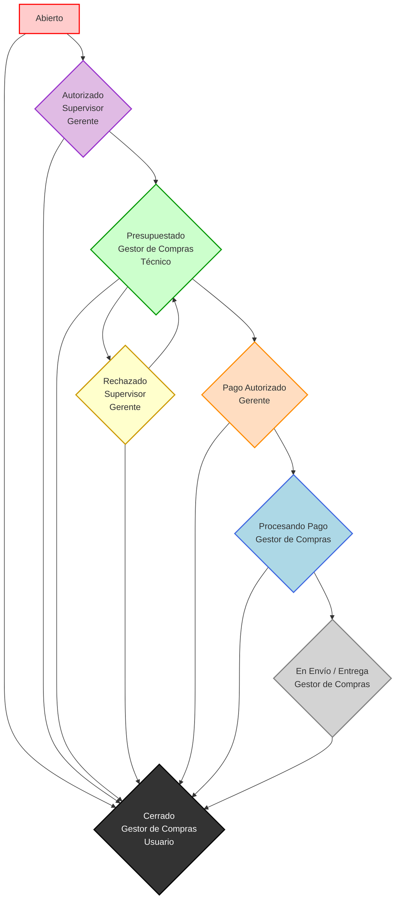

# Diagrama de Flujo del Proceso de Pagos (Welp PayFlow)

Este diagrama visualiza el ciclo de vida completo de una solicitud de compra o pago en el sistema Welp PayFlow, desde su creación hasta su cierre. Muestra las diferentes fases por las que pasa un ticket y los roles responsables de cada transición.

