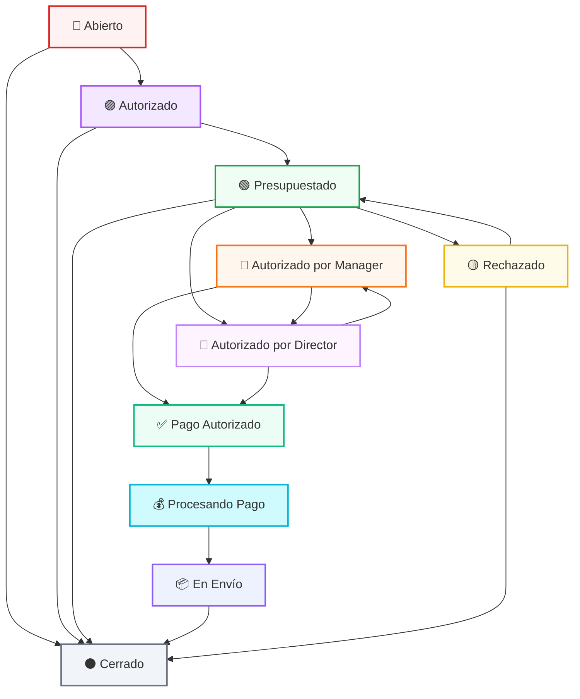

# Welp Payflow - Sistema de Gestión de Compras y Pagos

## 🎯 ¿Qué es Welp Payflow?

**Welp Payflow** es el sistema especializado para gestionar todas las **solicitudes de compra, pago y adquisiciones** dentro de la organización. Desde la compra de licencias de software hasta equipamiento, mobiliario y viáticos, Payflow centraliza y agiliza todo el proceso de autorización y pago.

### Casos de Uso Típicos
- 💻 **Software y Licencias**: Office 365, antivirus, herramientas especializadas
- 🖥️ **Equipamiento**: Computadoras, impresoras, hardware de red
- 🪑 **Mobiliario**: Escritorios, sillas, equipamiento de oficina
- 🛡️ **Elementos de Seguridad**: Cámaras, sistemas de acceso, EPP
- ✈️ **Viáticos**: Gastos de viaje, hospedaje, movilidad
- 🔧 **Servicios**: Mantenimiento, consultorías, capacitaciones

---

## 🏗️ Arquitectura del Sistema

### Estructura Organizacional
```
UDN (Unidad de Negocio) → Sector → Solicitud
```

**Datos Reales del Sistema:**
- **UDN**: "Km 1151", "Las Bóvedas", "Oficina Espejo"
- **Sectores**: "Full", "Playa", "Administración", "Parador"
- **Categorías**: Compras, Software, Licencias, Equipamiento, Mobiliario, Elementos de Seguridad

### Sistema de Permisos Simplificado
Los permisos se asignan únicamente a nivel **UDN** y **Sector**. Todas las categorías y solicitudes del sector heredan automáticamente estos permisos, eliminando la complejidad de gestionar permisos por categoría individual.

---

## 👥 Roles del Sistema

### 1. **Usuario Final** 
**Descripción**: Empleados de la organización que necesitan productos o servicios.
- ✅ `can_open` - Crear solicitudes
- ❌ `can_comment` - Solo puede comentar sus propias solicitudes
- ❌ Resto de permisos

**Capacidades**:
- Crear solicitudes para sus necesidades
- Ver estado de sus propias solicitudes
- Añadir comentarios a sus tickets
- Confirmar recepción para cerrar solicitudes

### 2. **Técnico**
**Descripción**: Personal especializado que busca y evalúa presupuestos.
- ✅ `can_open` - Crear solicitudes
- ✅ `can_comment` - Comentar en tickets
- ✅ `can_solve` - Adjuntar presupuestos
- ❌ Resto de permisos

**Capacidades**:
- Una vez autorizada una solicitud, puede buscar y adjuntar presupuestos
- Evaluar opciones técnicas y comerciales
- Proporcionar recomendaciones sobre proveedores

### 3. **Supervisor de Área**
**Descripción**: Líder del equipo, realiza la primera validación de necesidades.
- ✅ `can_open` - Crear solicitudes
- ✅ `can_comment` - Comentar en tickets
- ✅ `can_authorize` - Primera autorización
- ✅ `can_close` - Cerrar tickets
- ❌ `can_solve`, `can_process_payment`

**Capacidades**:
- Ve todas las solicitudes de su UDN/Sector
- Realiza la **primera autorización** de solicitudes
- Puede rechazar solicitudes que no procedan
- Puede cerrar tickets en cualquier momento

### 4. **Responsable de Compras**
**Descripción**: Especialista en gestión de compras y relación con proveedores.
- ✅ `can_open` - Crear solicitudes
- ✅ `can_comment` - Comentar en tickets
- ✅ `can_solve` - Adjuntar presupuestos
- ✅ `can_process_payment` - Gestionar pagos y envíos
- ❌ `can_authorize`, `can_close`

**Capacidades**:
- Gestiona todas las solicitudes autorizadas
- Adjunta presupuestos de múltiples proveedores
- Procesa pagos una vez autorizados
- Coordina envíos y entregas

### 5. **Manager**
**Descripción**: Gerente de UDN con capacidad de autorización de pagos.
- ✅ `can_open` - Crear solicitudes
- ✅ `can_comment` - Comentar en tickets
- ✅ `can_authorize` - Autorizar solicitudes
- ✅ `can_process_payment` - **Primera firma para pagos**
- ✅ `can_close` - Cerrar tickets

**Capacidades**:
- Todas las capacidades de Supervisor
- **Primera firma** para autorización de pagos
- Control sobre toda su UDN o múltiples UDNs

### 6. **Director** ⭐ **NUEVO ROL**
**Descripción**: Nivel ejecutivo, segunda firma obligatoria para pagos.
- ✅ `can_open` - Crear solicitudes
- ✅ `can_comment` - Comentar en tickets
- ✅ `can_authorize` - Autorizar solicitudes
- ✅ `can_process_payment` - **Segunda firma para pagos**
- ✅ `can_close` - Cerrar tickets

**Capacidades**:
- Todas las capacidades de Manager
- **Segunda firma obligatoria** para autorización de pagos
- Control ejecutivo sobre el proceso completo

---

## 🔄 Estados del Ticket y Flujo Completo

### Estados Principales

1. **🔴 Abierto** (`open`)
   - Solicitud creada, esperando autorización inicial
   - **Responsable**: Supervisor, Manager, Director

2. **🟣 Autorizado** (`authorized`)
   - Solicitud aprobada, esperando presupuestos
   - **Responsable**: Responsable de Compras, Técnico

3. **🟢 Presupuestado** (`budgeted`)
   - Presupuestos adjuntados, esperando autorización de pago
   - **Responsable**: Manager (primera firma)

4. **🔶 Autorizado por Manager** (`authorized_by_manager`) ⭐ **NUEVO**
   - Manager ha firmado, esperando autorización del Director
   - **Responsable**: Director (autorización paralela)

5. **💎 Autorizado por Director** (`authorized_by_director`) ⭐ **NUEVO**
   - Director ha firmado, esperando autorización del Manager
   - **Responsable**: Manager (autorización paralela)

6. **✅ Pago Autorizado** (`payment_authorized`)
   - **Estado automático** cuando se completan ambas firmas
   - **Responsable**: Responsable de Compras

7. **💰 Procesando Pago** (`processing_payment`)
   - Trámites de pago en curso
   - **Responsable**: Responsable de Compras

8. **📦 En Envío** (`shipping`)
   - Producto/servicio pagado y en camino
   - **Responsable**: Responsable de Compras, Usuario

9. **🟡 Rechazado** (`rejected`)
   - Solicitud o presupuestos rechazados
   - **Responsable**: Responsable de Compras, Técnico

10. **⚫ Cerrado** (`closed`)
    - Solicitud finalizada

---

## 🔀 Matriz de Transiciones

### Flujo Principal con Doble Autorización

| Estado Actual | Estado Destino | Quién Puede | Descripción |
|---------------|----------------|-------------|-------------|
| `open` | `authorized` | Supervisor, Manager, Director | Primera validación |
| `open` | `closed` | Supervisor, Manager, Director | Cancelación |
| `authorized` | `budgeted` | Responsable de Compras, Técnico | Adjuntar presupuestos |
| `budgeted` | `authorized_by_manager` | Manager | Autorización Manager |
| `budgeted` | `authorized_by_director` | Director | Autorización Director |
| `budgeted` | `rejected` | Supervisor, Manager, Director | Rechazar presupuestos |
| `authorized_by_manager` | `authorized_by_director` | Director | **Autorización paralela** |
| `authorized_by_manager` | `payment_authorized` | **Sistema (Automático)** | **Si Director ya autorizó** |
| `authorized_by_director` | `authorized_by_manager` | Manager | **Autorización paralela** |
| `authorized_by_director` | `payment_authorized` | **Sistema (Automático)** | **Si Manager ya autorizó** |
| `payment_authorized` | `processing_payment` | Responsable de Compras | Iniciar pago |
| `processing_payment` | `shipping` | Responsable de Compras | Confirmar envío |
| `shipping` | `closed` | Usuario, Responsable de Compras | Confirmar recepción |
| `rejected` | `budgeted` | Responsable de Compras, Técnico | Nuevos presupuestos |
| `rejected` | `closed` | Supervisor, Manager, Director | Cancelación tras rechazo |

### ⚡ Sistema de Autorización Paralela

**Característica Clave**: Manager y Director pueden autorizar **independientemente** y en **cualquier orden**:

1. **Desde Presupuestado**: Ambos pueden autorizar simultáneamente
2. **Orden Flexible**: No importa quién autoriza primero
3. **Detección Automática**: El sistema verifica automáticamente si ambas firmas están presentes
4. **Transición Automática**: Cuando ambas autorizaciones están completas → `payment_authorized`

**Escenarios Posibles**:
- Manager autoriza → Director autoriza → Sistema autoriza pago
- Director autoriza → Manager autoriza → Sistema autoriza pago  
- Ambos autorizan "simultáneamente" → Sistema autoriza pago

### Estados Especiales de Cancelación

Cualquier ticket puede ser cerrado directamente desde cualquier estado por:
- **Supervisor, Manager, Director**: En cualquier momento (cancelación administrativa)
- **Usuario creador**: Puede cerrar sus propios tickets
- **Responsable de Compras**: Durante las fases de gestión

---

## 📊 Flujo Visual del Proceso



---

## 🎯 Casos de Uso Detallados

### Caso 1: Flujo Completo - Compra de Licencias Office 365

1. **👤 Ana (Usuario Final)** crea solicitud: "Licencias Office 365 para equipo de ventas - 10 usuarios" → **🔴 Abierto**

2. **👔 Carlos (Supervisor)** revisa y aprueba: "Autorizado para cotizar. Necesario para proyecto Q4" → **🟣 Autorizado**

3. **🛒 María (Responsable de Compras)** busca proveedores y adjunta 3 presupuestos:
   - Proveedor A: $2,800 (recomendado)
   - Proveedor B: $3,100
   - Proveedor C: $2,950
   → **🟢 Presupuestado**

4. **👑 Luis (Manager)** revisa presupuestos: "Apruebo Proveedor A. Mejor relación precio-calidad" → **🔶 Autorizado por Manager**

5. **⭐ Roberto (Director)** también autoriza (paralelo): "Confirmado. Proceder con Proveedor A" → **💎 Autorizado por Director**

6. **🤖 Sistema** detecta doble autorización: "Ambas firmas completadas. Pago autorizado automáticamente" → **✅ Pago Autorizado**

7. **🛒 María** procesa el pago: "Enviado a Pagos y Proveedores. Orden #PO-2024-0156" → **💰 Procesando Pago**

8. **🛒 María** confirma entrega: "Licencias activadas. Credenciales enviadas por email" → **📦 En Envío**

9. **👤 Ana** confirma recepción: "Recibido y funcionando correctamente. Gracias!" → **⚫ Cerrado**

### Caso 2: Flujo con Rechazo y Corrección

1. **👤 Pedro (Usuario Final)**: "Equipo de cómputo de alta gama - $4,500" → **🔴 Abierto**

2. **👔 Sandra (Supervisor)**: "Autorizado para evaluar opciones" → **🟣 Autorizado**

3. **⚙️ Jorge (Técnico)** adjunta presupuestos excesivos → **🟢 Presupuestado**

4. **👑 Ana (Manager)**: "Presupuestos muy altos. Buscar alternativas más económicas" → **🟡 Rechazado**

5. **⚙️ Jorge** busca nuevas opciones más ajustadas al presupuesto → **🟢 Presupuestado**

6. **👑 Ana**: "Mejor opción. Aprobado" → **🔶 Autorizado por Manager**

7. **⭐ Director**: "Confirmado" → **💎 Autorizado por Director** 

8. **🤖 Sistema** detecta ambas firmas: → **✅ Pago Autorizado**

9. Continúa flujo normal...

### Caso 3: Flujo Paralelo Inverso (Director primero)

1. **👤 Carmen (Usuario Final)**: "Equipamiento de seguridad - $1,200" → **🔴 Abierto**

2. **👔 Pedro (Supervisor)**: "Autorizado para cotizar" → **🟣 Autorizado**

3. **⚙️ Ana (Técnico)** adjunta presupuestos → **🟢 Presupuestado**

4. **⭐ Roberto (Director)** autoriza primero: "Aprobado por Dirección" → **💎 Autorizado por Director**

5. **👑 Luis (Manager)** autoriza después: "Confirmado desde Gerencia" → **🔶 Autorizado por Manager**

6. **🤖 Sistema** detecta doble autorización: → **✅ Pago Autorizado**

7. Continúa flujo normal...

---

## 🔐 Configuración de Permisos por Rol

### Ejemplos de Configuración

```python
# Usuario Final - Solo sus propias solicitudes
PayFlowRoles(user=juan, udn=km_1151, sector=administracion, can_open=True)

# Técnico - Ve solicitudes autorizadas de su sector
PayFlowRoles(user=ana, udn=km_1151, sector=administracion, 
            can_open=True, can_comment=True, can_solve=True)

# Supervisor - Todo su sector, primera autorización
PayFlowRoles(user=carlos, udn=las_bovedas, sector=administracion, 
            can_open=True, can_comment=True, can_authorize=True, can_close=True)

# Responsable de Compras - Múltiples UDNs, gestión completa
PayFlowRoles(user=maria, udn=None, sector=None, 
            can_open=True, can_comment=True, can_solve=True, can_process_payment=True)

# Manager - Primera firma, control por UDN
PayFlowRoles(user=luis, udn=km_1151, sector=None, 
            can_open=True, can_comment=True, can_authorize=True, 
            can_process_payment=True, can_close=True)

# Director - Segunda firma, control total
PayFlowRoles(user=roberto, udn=None, sector=None, 
            can_open=True, can_comment=True, can_authorize=True, 
            can_process_payment=True, can_close=True)
```

---

## 💬 Sistema de Comentarios

### Importante: Los Comentarios NO Cambian Estados

Los comentarios son **información adicional** que acompaña las transiciones de estado, pero no constituyen estados en sí mismos. El estado formal del ticket solo cambia cuando se ejecuta una **acción específica** de transición.

### Tipos de Comentarios Automáticos

- **Autorización**: "Solicitud autorizada por [Supervisor]"
- **Presupuestado**: "Presupuestos adjuntados: 3 opciones disponibles"
- **Primera Firma**: "Autorizado por Manager: [Nombre] - [Comentario]"
- **Segunda Firma**: "Autorizado por Director: [Nombre] - [Comentario]"
- **Pago Autorizado**: "Doble autorización completada automáticamente"
- **Rechazo**: "Presupuestos rechazados: [Motivo detallado]"

---

## 🎛️ Características Técnicas del Sistema

### Herencia Automática de Permisos
1. **Asignación Simplificada**: Permisos solo a nivel UDN/Sector
2. **Herencia en Cascada**: Categorías y solicitudes heredan automáticamente
3. **Filtrado Inteligente**: Sistema filtra automáticamente por contexto del usuario
4. **Escalabilidad**: Fácil agregar nuevas categorías sin configurar permisos

### Seguridad y Auditabilidad
- **Trazabilidad Completa**: Cada acción queda registrada con usuario y timestamp
- **Doble Autorización**: Mecanismo de firma dual para pagos
- **Permisos Granulares**: Control fino sobre qué puede hacer cada rol
- **Validación de Contexto**: Usuario solo ve tickets de su alcance organizacional

### Automatización Inteligente
- **Transición Automática**: `payment_authorized` se activa automáticamente
- **Notificaciones**: Sistema alerta a responsables en cada etapa
- **Validación de Estados**: Previene transiciones inválidas
- **Gestión de Archivos**: Adjuntos automáticamente asociados por estado

---

## 📈 Beneficios del Sistema Payflow

### Para la Organización
- **Control Financiero**: Doble autorización previene gastos no autorizados
- **Transparencia**: Trazabilidad completa del proceso de compras
- **Eficiencia**: Automatización reduce tiempos de gestión
- **Cumplimiento**: Asegura seguimiento de políticas internas

### Para los Usuarios
- **Simplicidad**: Proceso claro y bien definido
- **Visibilidad**: Estado siempre visible del trámite
- **Rapidez**: Flujo optimizado reduce demoras
- **Comunicación**: Comentarios mantienen a todos informados

### Para los Gestores
- **Dashboard Centralizado**: Vista única de todas las solicitudes
- **Priorización**: Estados claros facilitan gestión de urgencias
- **Reportería**: Métricas automáticas de gestión
- **Escalamiento**: Sistema crece con la organización

---

**Welp Payflow** transforma la gestión de compras de un proceso manual y fragmentado en un flujo digital integrado, ágil y completamente auditable.
